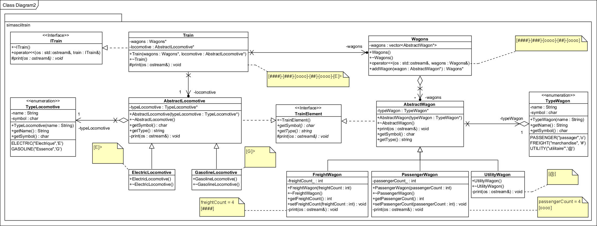

# Sim Ascii Train

# TP C++

# Made with ❤️ by [JAD](mailto:jeanaymeric@gmail.com)

## Consignes :

Vous devez implémenter en C++ les diagramm de classes fourni dans le dossier `img`.

Voici le **diagramme de classes** que vous devez réaliser pour ce TP :



Le dépot contient un fichier `main.cpp` qui contient le code suivant :

```cpp
#include <iostream>
#include "FreightWagon.h"
#include "AbstractWagon.h"
#include "PassengerWagon.h"
#include "UtilityWagon.h"
#include "ElectricLocomotive.h"
#include "GasolineLocomotive.h"
#include "Wagons.h"
#include "AbstractLocomotive.h"
#include "Train.h"

using namespace simasciitrain;

int main() {
	AbstractWagon *freightWagon = new FreightWagon(5);
	std::cout << *freightWagon << std::endl;            //	[#####]
	AbstractWagon *passengerWagon = new PassengerWagon(5);
	std::cout << *passengerWagon << std::endl;          //	[OOOOO]
	AbstractWagon *utilityWagon = new UtilityWagon();
	std::cout << *utilityWagon << std::endl;            //	[@]

	AbstractLocomotive *electricLocomotive = new ElectricLocomotive();
	std::cout << *electricLocomotive << std::endl;        //	[E]>
	AbstractLocomotive *gasolineLocomotive = new GasolineLocomotive();
	std::cout << *gasolineLocomotive << std::endl;        //	[G]>

	Wagons wagons;
	wagons.addWagon(freightWagon)->addWagon(passengerWagon)->addWagon(utilityWagon);
	std::cout << wagons << std::endl;                    //	[#####]-[OOOOO]-[@]

	Train aTrain(&wagons, electricLocomotive);
	std::cout << aTrain << std::endl;                    //	[#####]-[OOOOO]-[@]-[E]>

	Wagons wagons2;
	wagons2.addWagon(new FreightWagon(3))
		->addWagon(new PassengerWagon(2))
		->addWagon(new UtilityWagon())
		->addWagon(new FreightWagon(1))
		->addWagon(new PassengerWagon(5))
		->addWagon(new PassengerWagon(5))
		->addWagon(new PassengerWagon(5))
		->addWagon(new PassengerWagon(5));
	Train anotherTrain(&wagons2, gasolineLocomotive);
	std::cout << anotherTrain << std::endl;                //	[###]-[OO]-[@]-[#]-[OOOOO]-[OOOOO]-[OOOOO]-[OOOOO]-[G]>

	return 0;
}
```

Ce code vous permettra de tester votre implémentation. Mettez en commentaire les lignes qui ne fonctionnent pas pour le
moment et décommentez les au fur et à mesure que vous implémentez les classes.


